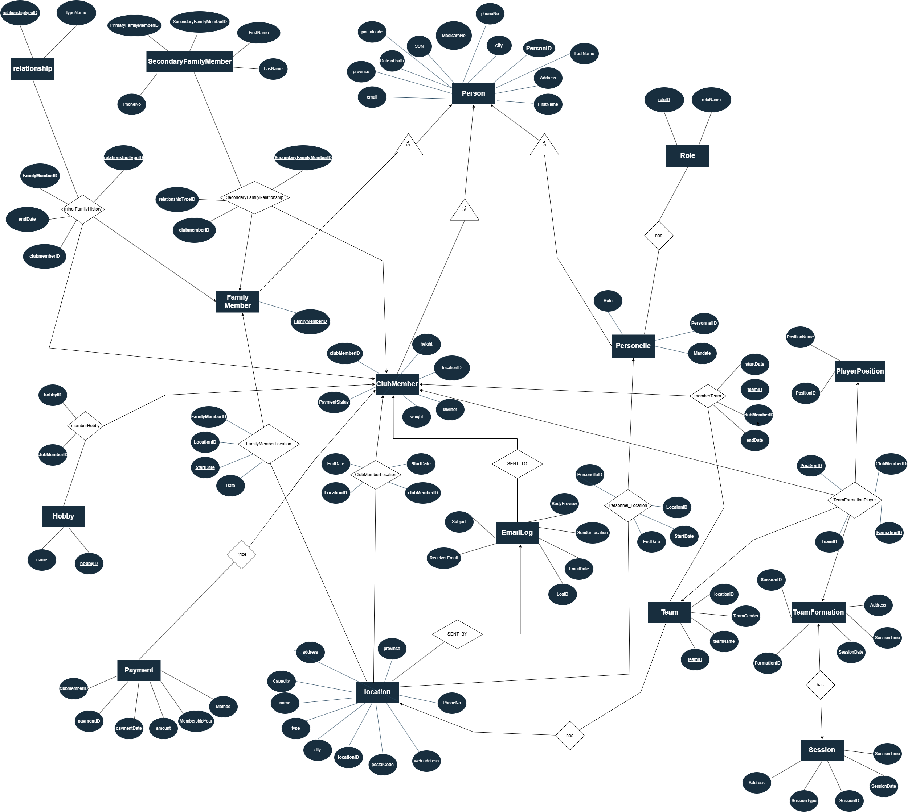

# MVC Club Manager

MVC Club Manager is a Streamlit + MySQL web application for managing a volleyball club database. The project includes a normalized relational schema, a Python GUI, CRUD operations, reporting queries, triggers, and secure database connectivity through environment variables.

## Live Website


[Open MVC Club Manager](https://mvc-club-database.streamlit.app/)

Test Credentials:
-Username: admin
-Password: password123


Note: If the app has been inactive, Streamlit may show a sleeping page. Click "Yes, get this app back up!" and wait a few moments for the app to restart.

## Screenshots

### E/R Diagram



## Main Features

- Dashboard with club statistics and charts.
- Member, personnel, team, payment, session, location, family member, and email log management.
- Add, view, update, delete, and search records through the Streamlit interface.
- MySQL database with primary keys, foreign keys, relationship tables, and history tables.
- SQL triggers for database-level business rules.
- Credentials kept outside the code using `.env` locally or Streamlit secrets online.

## Tech Stack

| Part | Technology |
|---|---|
| GUI | Streamlit |
| Language | Python |
| Database | MySQL / Aiven MySQL |
| Python database connector | mysql-connector-python |
| Data display | pandas |
| Environment variables | python-dotenv |
| Database script | script.sql |

## How to Use the App

Use the sidebar to move between pages:

- Dashboard: view summary metrics and charts.
- Members: manage club members and payment status.
- Personnel: manage coaches, administrators, captains, and volunteers.
- Teams: manage teams, coaches, locations, and rosters.
- Sessions & Formations: manage training sessions, games, formations, and scores.
- Payments: record and view member payments.
- Locations: manage club locations.
- Family Members: view family contacts and minor relationships.
- Email Log: view and create email log records.

## SQL Script Summary

The single `script.sql` file includes:

- Table creation for the relational schema.
- Sample insert statements.
- Triggers for business-rule enforcement.
- Queries for CRUD operations, joins, reports, aggregations, validations, and email logs.

## Table Summary

The database is organized around these main groups:

- Person records: shared personal information for members, personnel, and family contacts.
- Club members: member-specific details, payment status, hobbies, location history, and team history.
- Personnel: coaches, captains, administrators, mandates, and location assignments.
- Teams and sessions: teams, formations, games, training sessions, players, positions, and scores.
- Locations: head office and branch information.
- Payments: membership payment transactions.
- Family relationships: family contacts and minor-family relationships.
- Email logs: records of generated or stored communication history.

## Trigger Summary

The trigger section enforces rules such as:

- Preventing invalid or duplicate formation assignments.
- Preventing overlapping active team memberships.
- Enforcing age-related constraints.
- Checking location capacity rules.
- Maintaining database consistency during inserts or updates.

## Query Summary

The query section demonstrates:

- Basic CRUD operations.
- Search and filtering.
- Join-based reports.
- Grouping and aggregation.
- Payment summaries.
- Team and formation reports.
- Member participation reports.
- Trigger validation tests.

## Normalization Summary

The schema is designed to satisfy 3NF and BCNF based on the intended functional dependencies.

### 3NF

The schema avoids transitive dependencies by separating information into focused tables. For example, shared personal data is stored in `Person`, while role-specific information is stored in `ClubMember`, `Personnel`, and `FamilyMember`. Many-to-many relationships are handled through separate relationship tables instead of repeating groups in entity tables.

### BCNF

The schema follows BCNF because determinants are represented as keys in the intended design. Entity tables use primary keys, subtype tables reuse the `Person` identifier, lookup tables store repeated values, and relationship/history tables use keys that identify the full relationship they represent.

Some fields, such as current member payment status or current location, are included for GUI convenience, while detailed history is still preserved in the related transaction and history tables.


## Project Structure

```text
Database_GUI/
|
|-- app.py
|-- test_db.py
|-- script.sql
|-- requirements.txt
|-- .env.example
|-- .gitignore
|-- README.md
|-- screenshots/
    |-- dashboard.png
    |-- members.png
    |-- teams.png
    |-- payments.png
    |-- reports.png
```

Files that should not be committed to GitHub:

```text
.env
ca.pem
venv/
__pycache__/
*.pyc
.streamlit/secrets.toml
```

## Requirements

- Python 3.10 or newer.
- MySQL-compatible database such as Aiven MySQL or local MySQL.
- MySQL Workbench, DBeaver, or another SQL client.
- Git, if cloning the repository.

Note: The database uses MySQL triggers. TiDB Cloud is not recommended for the full version because TiDB does not support MySQL triggers.

## Dependencies

Install dependencies from `requirements.txt`:

```txt
streamlit
mysql-connector-python
pandas
python-dotenv
```

## Environment Variables

Create a private `.env` file locally based on `.env.example`:

```env
DB_HOST=your-host.aivencloud.com
DB_PORT=your-port
DB_USER=avnadmin
DB_PASSWORD=your-password
DB_NAME=mvc_club_dd
DB_SSL_CA=./ca.pem
```

For Streamlit Community Cloud, add these values in the app's secrets settings instead of uploading `.env`.

## Database Setup

The full database is contained in one file:

```text
script.sql
```

In MySQL Workbench or DBeaver, create and select the database:

```sql
CREATE DATABASE IF NOT EXISTS mvc_club_dd;
USE mvc_club_dd;
```

Then run the full `script.sql` file.

To confirm the database was created correctly:

```sql
SHOW TABLES;
SELECT COUNT(*) FROM ClubMember;
SELECT COUNT(*) FROM Personnel;
SELECT COUNT(*) FROM Team;
SELECT COUNT(*) FROM Location;
```

## How to Run Locally

### 1. Clone the repository

```bash
git clone https://github.com/YOUR_USERNAME/YOUR_REPOSITORY.git
cd YOUR_REPOSITORY
```

### 2. Create a virtual environment

Windows PowerShell:

```powershell
py -m venv venv
venv\Scripts\Activate
```

macOS/Linux:

```bash
python3 -m venv venv
source venv/bin/activate
```

### 3. Install dependencies

```bash
pip install -r requirements.txt
```

### 4. Create the `.env` file

Copy `.env.example` into a new file named `.env`, then fill in the real database credentials.

### 5. Test the connection

```bash
python test_db.py
```

Expected output example:

```text
('mvc_club_dd', '8.4.8')
```

The version number may be different depending on the MySQL server.

### 6. Run the app

```bash
python -m streamlit run app.py
```

Open the local URL:

```text
http://localhost:8501
```


